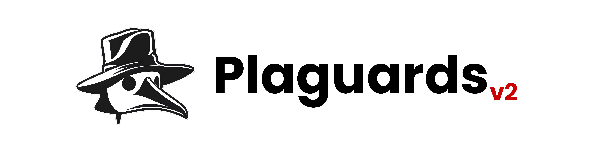

# PlaguardsV2: Open Source Static Deobfuscation and IOC Detection Engine with Analyst Triage for Blue Teams.

<p align="center">

</p>

---

<p align="center">
 <a href="#"></a>
 <a href="#"></a>
 <a href="#"></a>
 <a href="#"></a>
 <a href="#"></a>
 <a href="https://github.com/baycysec/plaguards"></a>
</p>

## What it does

You give it a suspicious script. It gives you back readable code, a list of
indicators, and a report you can hand to someone else.

- **Reads the script for you.** Obfuscated PowerShell, VBScript, JScript,
  batch and cmd get unpicked into plain text.
- **Finds the indicators.** IPs, domains, URLs, hashes, registry keys,
  mutexes and User-Agents, including ones assembled at runtime.
- **Checks them automatically.** Every indicator is looked up against your
  threat-intel providers as part of the analysis, not as a separate step.
- **Tells you where they are.** Addresses get country, city, ASN and
  reverse DNS.
- **Lets you decide.** Mark each finding Threat, False Positive or Unknown.
- **Writes it up.** A PDF report, plus Excel and CSV of the same findings.

> [!IMPORTANT]
> **Nothing you submit is ever executed.** Every transform rewrites literal
> values only - no `eval`, no sandbox, no PowerShell process. Deobfuscation,
> extraction, storage and reporting all run offline. The only thing that
> leaves your machine is an indicator value sent to a provider you configured.

## Why it exists

- Attackers do not ship readable scripts. They split strings, Base64 whole
  stages, build characters out of arithmetic and scatter backticks through
  cmdlet names - so a defender sees noise instead of a URL.
- Most tools only *detect* that a script is obfuscated. You are left with the
  same wall of text.
- The same tricks show up in the `.vbs`, `.js`, `.bat` and `.cmd` files that
  arrive alongside, and in the logs that record them afterwards.
- PlaguardsV2 finishes the job for all of them, and ends with an artefact:
  what was applied, what was found, and what you decided.

## Main Features

**1. Static deobfuscation** - multi-pass, multi-language, never executes anything.

- *PowerShell:* encoded commands; Base64 (including gzip/deflate stages);
  string concatenation; `-join` / `-split` / `-replace`; the `-f` format
  operator; `[char]` codes and arithmetic (`+ - * /` and `-bxor`); `$(...)`
  subexpressions; `[Text.Encoding]::*.GetString`; `[byte[]]` arrays;
  backticks; `[string]` casts; whitespace; statement splitting on `;`; and
  variable tracking through reassignment chains.
- *VBScript:* `Chr()` with arithmetic, `&` concatenation, `StrReverse`,
  `Replace`, `Split`/`Join`, `Mid`/`Left`/`Right`, `UCase`/`LCase`/`Trim`,
  Base64 literals, variable propagation.
- *JScript:* `String.fromCharCode` with arithmetic, `atob`, `unescape`,
  hex and unicode escapes, Base64 literals, `split`/`reverse`/`join`,
  `replace`, `substring`/`substr`/`slice`/`charAt`, case and trim,
  variable propagation.
- *Batch / cmd:* `set` chains, `%var%` and delayed `!var!` expansion,
  `%var:~offset,length%` carving, `%var:find=replace%`, caret escapes.
- *Raw data and logs:* a line that is entirely a Base64 blob or a list of
  character codes is decoded in place.
- Every pass that fires is written to a transform log.

**2. Indicator and signature extraction**

- IPs, domains, URLs, emails, MD5/SHA-1/SHA-256 hashes.
- Defanged forms too - `1[.]2[.]3[.]4`, `hxxp://`.
- Registry keys, mutexes, User-Agents, `ip:port` pairs, partial hashes.
- A signature ruleset for download cradles, in-memory execution, LOLBins,
  persistence, AMSI references and hidden-window flags.
- Each tagged with its MITRE ATT&CK technique.

**3. IOC Checker** - one indicator, checked on its own.

- Leave the type on **Detect automatically** and the value's shape decides.
- Or choose **IP**, **Domain**, **URL**, **File hash** or
  **Malware signature / family**.
- A signature (`AgentTesla`, `Formbook`) has no detectable shape, so picking
  the type by hand is the only way to reach it - the same `hash` /
  `signature` / `domain` / `ip` set Plaguards v1 offered.

**4. Threat intelligence** - seven providers, all optional.

- VirusTotal, abuse.ch (MalwareBazaar / ThreatFox / URLhaus), AbuseIPDB,
  AlienVault OTX, Shodan, GreyNoise, Pulsedive.
- One config point and one Settings page for every key.
- Results are cached locally, so re-running a sample does not spend quota.
- Every result row links to that provider's own page for the indicator.
- Reserved and non-routable values are marked *not applicable* with the
  reason, instead of burning a lookup that cannot return anything.

**5. IP geolocation** - inspired by [HolmesGeo](https://github.com/jon-brandy/HolmesGeo).

- Country, city, coordinates, continent, ASN, organisation, network.
- Reverse DNS, and a category for every address (public, private,
  documentation, loopback).
- Prefers **local MaxMind GeoLite2 databases** - fully offline, the address
  never leaves the machine. Settings has a separate field for City, Country
  and ASN - each takes a `.mmdb` file, a folder, or MaxMind's downloaded
  `.tar.gz` archive (extracted automatically) - and whichever are filled in
  are merged into one record. Falls back to ipinfo.io if you give it a token.

**6. Analyst triage** - your call is the conclusion.

- Mark each finding Confirmed Threat, False Positive or Unknown.
- Do it one at a time, or all at once.
- Severity describes the *technique observed*, not confirmed impact.

**7. Reporting**

- A PDF: cover, clickable contents with page numbers, formal disclaimer,
  summary with charts, findings table, per-finding detail, transform log,
  resolved variables, and both scripts in full.
- **Excel and CSV** of the same findings, with the geolocation columns -
  sortable, filterable, ready to paste into a ticket.
- Indicators are defanged throughout, and can be redacted before sharing.
- A batch gives you separate PDFs or one combined document.

**8. CLI and dashboard, one pipeline**

- Both front ends call the same engine and share one database.
- A script analyzed in a terminal shows up in the dashboard's History.
- A verdict recorded in the browser appears in a report generated later
  from the command line.

## Requirements

- Python 3.12+
- Docker and Docker Compose v2 *(optional — the installer falls back to a local virtualenv)*
- Port 8000

> [!NOTE]
> **No manual installation needed — one script handles everything.**

## Deployment and Usage

**1. Clone the repository.**

```console
git clone <your-fork-url> plaguardsv2
cd plaguardsv2
```

**2. Run the installer.**

```powershell
# Windows
.\install.ps1
```

```bash
# Linux / macOS
./install.sh
```

Either script creates `.env` from `.env.example` if it is missing, uses Docker when a daemon is actually running, otherwise sets up a local virtual environment — then starts the app and opens `http://localhost:8000`.

**3. Try it without finding a sample first.** The dashboard's *Run the example script* button analyzes the bundled inert demo in `samples/` end to end, report included.

### Threat intel setup (optional)

Configure any subset from the **Settings** page, or edit `.env` directly. Without a key a provider is skipped and labelled `not_checked`; deobfuscation and indicator extraction are unaffected.

| Provider | Env var | Get a key |
|---|---|---|
| VirusTotal | `VT_API_KEY` | https://www.virustotal.com/gui/my-apikey |
| abuse.ch (MalwareBazaar / ThreatFox / URLhaus) | `ABUSECH_API_KEY` | https://auth.abuse.ch/ |
| AbuseIPDB | `ABUSEIPDB_API_KEY` | https://www.abuseipdb.com/account/api |
| AlienVault OTX | `OTX_API_KEY` | https://otx.alienvault.com/api |
| Shodan | `SHODAN_API_KEY` | https://account.shodan.io/ |
| GreyNoise (Community) | `GREYNOISE_API_KEY` | https://viz.greynoise.io/account/ |
| Pulsedive | `PULSEDIVE_API_KEY` | https://pulsedive.com/api/ |
| ipinfo.io *(geolocation)* | `IPINFO_TOKEN` | https://ipinfo.io/account/token |

For geolocation, **local MaxMind GeoLite2 databases** are preferred over ipinfo - Settings → Geolocation Databases has one field each for City, Country and ASN, each taking a `.mmdb` file, a folder, or MaxMind's `.tar.gz` download, and lookups never leave your machine. That section also carries step-by-step instructions for getting them free from [MaxMind](https://dev.maxmind.com/geoip/geolite2-free-geolocation-data).

> [!WARNING]
> Keys are stored in the local SQLite database on the machine you run this on. Do not commit `.env`, and do not hardcode keys in source.

### Dashboard

| Page | What it does |
|---|---|
| **Analyze** | Paste a script, or drop files anywhere on the page — `.ps1 .txt .vbs .js .bat .cmd .log`, or a `.zip`. Up to 200 files, 5 MB each, 100 MB per submission. A batch can produce separate reports or one combined document. The second card is the **IOC Checker**: one indicator, with the type detected automatically or chosen from the list. |
| **Result** | Deobfuscated script, transform log, resolved variables and the original input on the left; findings with context, MITRE mapping, threat intel and triage controls on the right. Export the findings as PDF, Excel or CSV. |
| **History** | Past analyses newest first. Select rows to export a zip of PDFs, build a combined report, or delete in bulk. Retention is configurable. |
| **Tutorial** | Every feature explained page by page, plus a guided tour that walks the whole app. |
| **Settings** | API keys, the three GeoLite2 database paths (City, Country, ASN), history retention, the analyst name printed on reports, the UTC offset used for timestamps, and a danger zone that clears stored history. |

### CLI usage

```console
python plaguardsv2-cli.py analyze <path|->     # a file, or '-'/omitted for stdin
    --pdf out.pdf                              # write a PDF report
    --json out.json                            # write JSON results
    --redact-iocs                              # print indicator values black-on-black
    --triage                                   # mark each finding interactively
    --no-intel                                 # skip all threat-intel providers
    --no-cache                                 # bypass the local intel cache
    --no-store                                 # don't persist to the local database
    --db-path FILE                             # use a different SQLite database

python plaguardsv2-cli.py list                 # show past analyses
```

### Manual setup

**Docker:**

```console
cp .env.example .env
docker compose up --build
```

**Local Python:**

```console
python -m venv .venv
# Windows: .venv\Scripts\activate      macOS/Linux: source .venv/bin/activate
pip install -r requirements-dev.txt
flask --app plaguardsv2.PlagWeb run --debug
```

**Tests:**

```console
pip install -r requirements-dev.txt
pytest
```

The suite includes a corpus of benign, inert samples covering every supported technique across all seven accepted file types — each one hides the same banner behind a different trick, and the tests assert we get the cleartext back.

## Architecture

```
plaguardsv2/
  GuardModules/
    PlagDeobfus.py     pass orchestration - never executes input
    PlagFold.py        folds expressions in place using the static evaluator
    PlagEval.py        recursive-descent evaluator over a restricted subset
    PlagTokens.py      tokenizer shared by the evaluator
    PlagTrace.py       sequential variable tracking through reassignment
    PlagLoader.py      byte-array loaders: key-combined blob, then inflate
    regex_utils.py     shared regex construction, written in one place
    PlagVbs.py         VBScript literal folding
    PlagJs.py          JScript literal folding
    PlagCmd.py         batch / cmd variable resolution
    PlagEncode.py      shared escape / base64 / percent decoding
    PlagArith.py       safe arithmetic for Chr() / fromCharCode()
    PlagGeo.py         IP geolocation (local GeoLite2, or ipinfo.io)
    PlagTable.py       findings as CSV / XLSX, geolocation included
    PlagLinks.py       deep links into each provider's own pages
    PlagGrep.py        indicator extraction + signature scanning
    PlagRules/         signature rule sets, MITRE-tagged (see note below)
    PlagProviders/     one threat-intel client per file
    PlagIntel.py       provider fan-out and cache orchestration
    PlagScope.py       what is worth querying, and why something was not
    PlagConfig.py      the single API-key / provider registry
    PlagStore.py       SQLite: analyses, findings, per-source intel, settings
    PlagBatch.py       bounded multi-file and archive extraction
    PlagEngine.py      the pipeline - shared by both front ends
    PlagReport.py      PDF rendering (front matter, findings, appendices)
    PlagCharts.py      matplotlib charts for the report
    PlagWatermark.py   the faint page-background mark behind each page
    PlagMitre.py       technique ID -> human-readable name
    PlagExplain.py     plain-English notes for each transform
    PlagFilter.py      upload validation and filename sanitization
  PlagWeb/             Flask dashboard - routes, templates, static assets
  PlagCLI.py           Click CLI
plaguardsv2-cli.py     thin root entry point
```

### Why the rules and a few other modules are split across many small files

While this was being built, local antivirus real-time protection repeatedly quarantined source files that gathered several "AV-evasion technique" keywords in one place — AMSI references, reflective assembly loading and Defender-tampering commands together read like a loader cheat sheet to a heuristic scanner. The very content that makes the tool useful for detection makes its *source* look suspicious.

Splitting the rule set and a few similarly dense modules into small, single-purpose files resolved it without changing any detection logic. If you hit the same problem while extending the rules or providers, keep new files small and focused, and consider a Defender exclusion for the project folder.

## Safety & privacy

- Submitted scripts are **never executed or evaluated**. Deobfuscation is pure text transformation, and the evaluator folds literals only.
- **No script content leaves your machine.** Only extracted indicator values — a hash, IP, domain or URL — are sent to providers you configured, and never the surrounding context.
- Deobfuscation, indicator matching, storage and PDF generation are **fully offline**.
- Reports are an **investigative aid, not a verdict.** Deobfuscation is best-effort and the transform log states exactly what was applied; threat-intel results reflect third-party data at query time. The analyst's triage decision is the authoritative call.
- Indicators are **defanged** in every report so nothing in a document you circulate is clickable, and can be redacted entirely before sharing.

## Credits

Built by **quifl** — [github.com/quifl](https://github.com/quifl) · [github.com/tkxldk](https://github.com/tkxldk)

On the foundation laid by **Plaguards v1** — [github.com/baycysec/plaguards](https://github.com/baycysec/plaguards).
